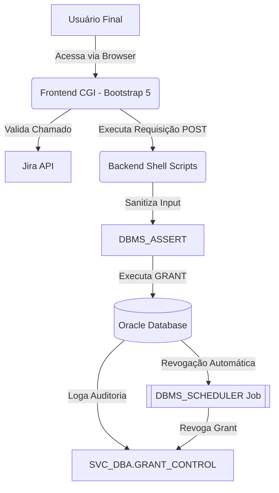

# 🛡️ Oracle Grant Manager (OGM)

O **Oracle Grant Manager** é uma solução de autoatendimento para usuários finais, projetada para automatizar e auditar a concessão de privilégios temporários em bancos de dados Oracle. O sistema garante que acessos sejam concedidos apenas sob demanda (via integração Jira) e revogados automaticamente após **15 dias**.

---

## 🚀 Arquitetura do Sistema

Antes de qualquer alteração, estude a arquitetura do sistema:
- FILE_MAP.md
- skills.md

O OGM foi construído com uma arquitetura leve e segura, separando as preocupações em camadas:

---

## ✨ Funcionalidades Principais

- **Autoatendimento Seguro**: Interface web intuitiva para usuários solicitarem acesso.
- **Validação de Chamado Jira**: Garante que o usuário possua um ticket aprovado antes de conceder o acesso.
- **Segurança Reforçada**: Proteção contra SQL Injection usando `DBMS_ASSERT` e sanitização rigorosa via Shell.
- **Revogação Automática**: Job nativo do Oracle garante que nenhum acesso expire sem ser revogado após 15 dias.
- **Auditoria Transparente**: Painel de auditoria interativo para acompanhamento de todos os privilégios concedidos e revogados.
- **Suporte Multi-Instância**: Gerencie grants em múltiplos bancos de dados a partir de uma única interface via catálogo TNS.

---

## 📂 Estrutura do Repositório

- 🖥️ `src/frontend/`: Scripts CGI (`index.cgi`, `audit.cgi`) que geram a interface web.
- ⚙️ `src/backend/`: Motor da aplicação (`grant_manager.sh`, `jira_validator.py`, `grant_reporter.sh`).
- 🗄️ `src/db/`: Scripts DDL para tabelas, sequences e schedulers.
- 📖 `docs/`: Documentação técnica e manuais de instalação.
- 📦 `_old/`: Arquivos redundantes e legados mantidos para histórico.

---

## 🛠️ Requisitos de Instalação

As instruções detalhadas de instalação podem ser encontradas em [docs/installation.md](docs/installation.md).

### Pré-requisitos Rápidos:
- Oracle Linux 8+
- Servidor Web Apache (`httpd`) com suporte a CGI.
- Oracle Instant Client (SqlPlus).
- Python 3.x com biblioteca `requests` e `python-dotenv`.

---

## 🔐 Melhores Práticas de Segurança

1. **Mínimo Privilégio**: O usuário de serviço `SVC_DBA` deve ter apenas as permissões necessárias para realizar grants nos objetos alvo.
2. **Credenciais**: Utilize o arquivo `.env` para gerenciar senhas. Nunca submetas senhas reais ao repositório.
3. **Restrição de Acesso**: Os scripts de backend (`/usr/local/bin/`) devem ter permissões restritas (ex: `chmod 750`).

---

  Desenvolvido pela Equipe DBA & Segurança | 2026

